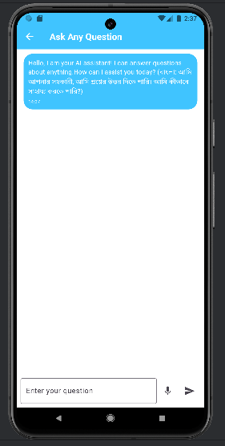
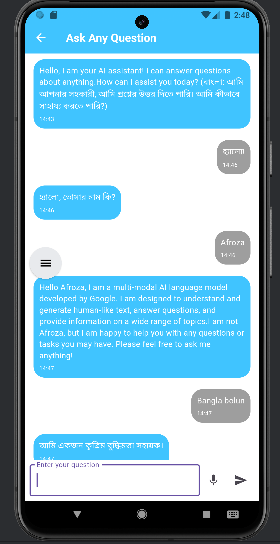
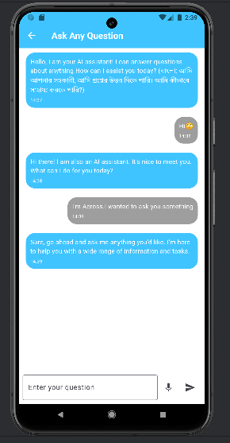
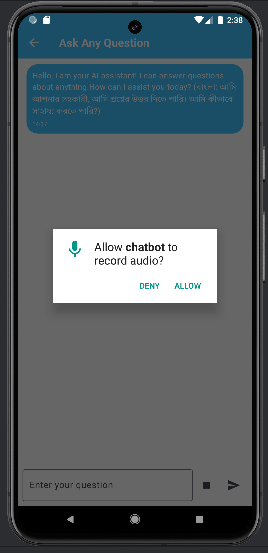

# Chatbot Application

A modern Flutter-based chatbot application featuring a voice assistant, multilingual support (English to Bangla), integration with the Gemini API, and interactive chat capabilities.

## Features

### 🌟 Gemini API Integration
- **AI-Powered Responses**: Leverages the Gemini API for intelligent and accurate responses.
- **Dynamic and Context-Aware**: Understands the context of the conversation to provide better assistance.
  
### 🔊 Voice Assistant
- **Natural Voice Interaction**: Communicate with the chatbot using your voice for a seamless experience.
- **Voice-to-Text Support**: Easily convert spoken commands into text for better interaction.

### 🌐 Multilingual Support
- **English to Bangla**: The chatbot supports bilingual communication, making it accessible for a broader audience.
- **Real-Time Translation**: Instant translation between English and Bangla.

### 💬 Interactive Chat
- **User-Friendly Interface**: Chat with the bot in a clean, responsive, and intuitive UI.
- **Customizable Features**: Modify settings to suit your preferences.

---

## Screenshots

### Home Screen


### Chat Screen


### Multilingual Translation



### Voice Assistant


---

## Getting Started

Follow these steps to set up the project on your local machine.

### Prerequisites
- Flutter SDK (version 3.6.0 or above)
- Android Studio or Visual Studio Code with Flutter plugins installed

### Installation
1. Clone this repository:
   ```bash
   git clone https://github.com/your-username/chatbot.git
